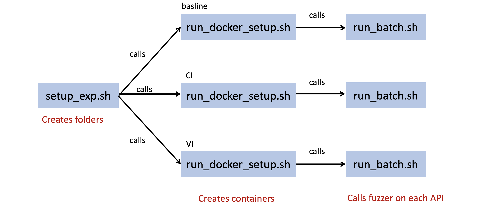

## Important Files

- `run_batch.sh`: Run the fuzzer for each APIs.
- `run_docker_setup.sh`: This file creates docker container and runs our fuzzer in it. 
- `setup_exp.sh`: The script I use for experiment. Do some pre-process and call `run_docker_setup.py`

To start a round of experiment: 

~~~python
bash setup_exp.sh tensorflow 10
~~~

#### `setup_exp.sh`

The `setup_exp.sh` script will automatically starts three experiment (baseline, CI, VI) by default. Here the second parameter `10` is simply the ID we give to the experiment as well as the container. It will creates corresponding folders, and calls `run_docker_setup.sh` with corresponding parameters.

#### `run_docker_setup.sh`

The script creates docker container and calls `run_batch.sh` to start the fuzzing processs.

#### `run_batch.sh`

The script iterates on each API in the given folder and calls `fuzzer-driver.py` to starts the experiemnt on each API. 

The parameter to pass into the fuzzer (`fuzzer-driver.py`) is specified here. It automatically sets the values to the parameter for baseline, DocTer-CI, DocTer-VI mode. If one need to set a particular parameter to specific value, the change need to be done here. 

The **file structure** when running the fuzzer:

`$home`

​    |___ `$home/code/dl-fuzzer`

​    |___ `$home/workdir`

- The `code` folder contains the code of the repository
- The experiment results are saved into `workdir` 
